# 电商多数据集综合数据分析

> 基于 pandas + pyecharts，对**天猫订单、双十一美妆、日化销售**三份业务数据集完成数据清洗、指标统计、多维可视化，包含订单整体指标、地理分布、时间走势、商品排行、RFM客户打分分析。

## 一、项目简介

### 1.1 项目目标
本项目处理三份业务数据源：
1. `tmall_order_report.csv`：天猫订单报表
2. `双十一淘宝美妆数据.csv`：双十一美妆商品销售数据
3. `日化.xlsx`：日化行业销售订单与商品信息（双sheet）

完成工作：
1. 数据清洗：去空格、去重、空值处理、日期解析、脏数据过滤、文本字段清洗；
2. 核心业务指标统计：订单总量、成交、退款、收入等汇总；
3. 可视化：地图、折线、柱状、时间轮播Timeline、饼图；
4. 表关联，多维度统计地区、时间、商品销量排行；
5. RFM模型实现客户综合打分。

### 1.2 技术栈
|工具|用途|
|---|---|
|pandas|csv/excel读取、数据清洗、分组聚合、表合并、RFM计算|
|pyecharts|Table、Map、Bar、Line、Pie、Timeline图表渲染|
|Jupyter Notebook|`render_notebook()` 交互式展示图表|

### 1.3 数据集字段简述
1. **tmall_order_report.csv（天猫订单）**
- 订单编号、订单创建时间、订单付款时间、总金额、退款金额、买家实际支付金额、收货地址
> 订单付款时间为空表示未付款订单；退款金额大于0代表发生退款。

2. **双十一淘宝美妆数据.csv**
- 店名、update_time 更新时间、price价格、sale_count销售量；衍生计算`sale_amount`销售额。

3. **日化.xlsx**
- `销售订单表(fact_order)`：订单日期、客户编码、所在省份、所在地市、订购数量、订购单价、金额
- `商品信息表(dim_product)`：商品编号、商品大类、商品小类等商品基础档案

## 二、第一部分：天猫订单数据分析（tmall_order_report.csv）

### 2.1 数据读取与基础清洗
```python
import pandas as pd
data = pd.read_csv('tmall_order_report.csv')
data.head() # 退款金额应该就是客户退货后，返还给客户的退款金额
data.info()  # 数据集情况 28010 条，6个字段
data.columns = data.columns.str.strip()  # 列名有空格，需要处理下
data.columns
data[data.duplicated()].count()  # 没有完全重复的数据
data.isnull().sum()   # 付款时间存在空值，表示订单未付款
# 省份名称清洗，去掉省、自治区等后缀，适配pyecharts地图
data['收货地址'] = data['收货地址'].str.replace('自治区|维吾尔|回族|壮族|省', '')
data['收货地址'].unique()
```

### 2.2 核心业务指标计算

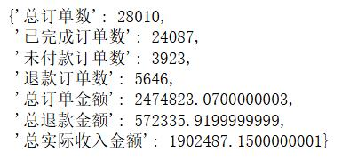

### 2.3 整体指标汇总表格

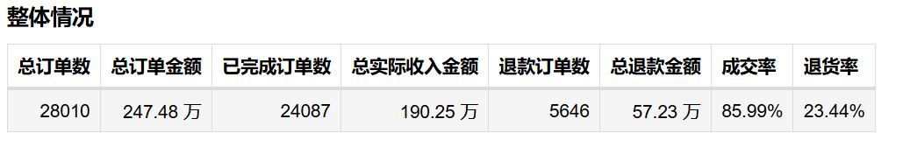

### 2.4 订单地区分布地图

统计**已付款订单**各省份订单量，绘制中国地图。

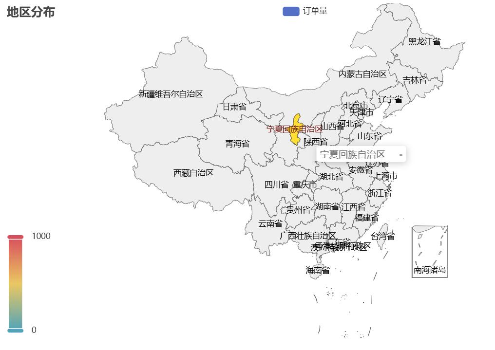

### 2.5 每日订单量走势折线图

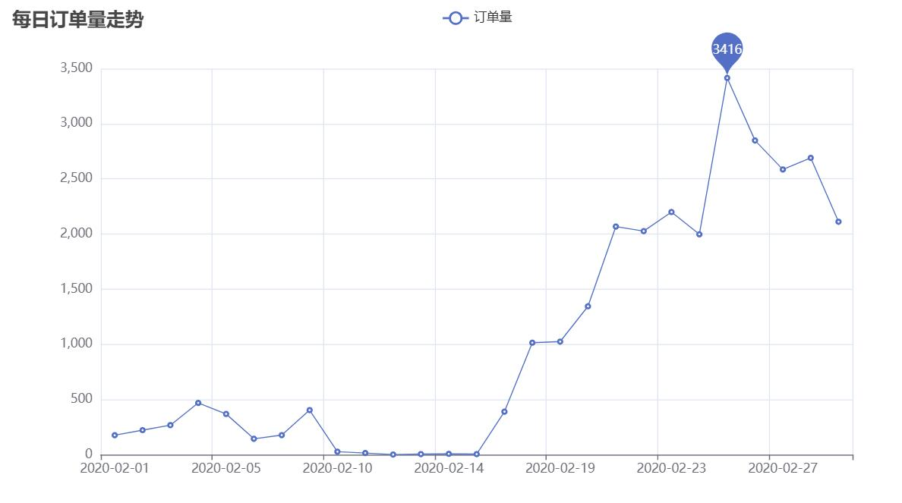

### 2.6 每小时订单量分布柱状图

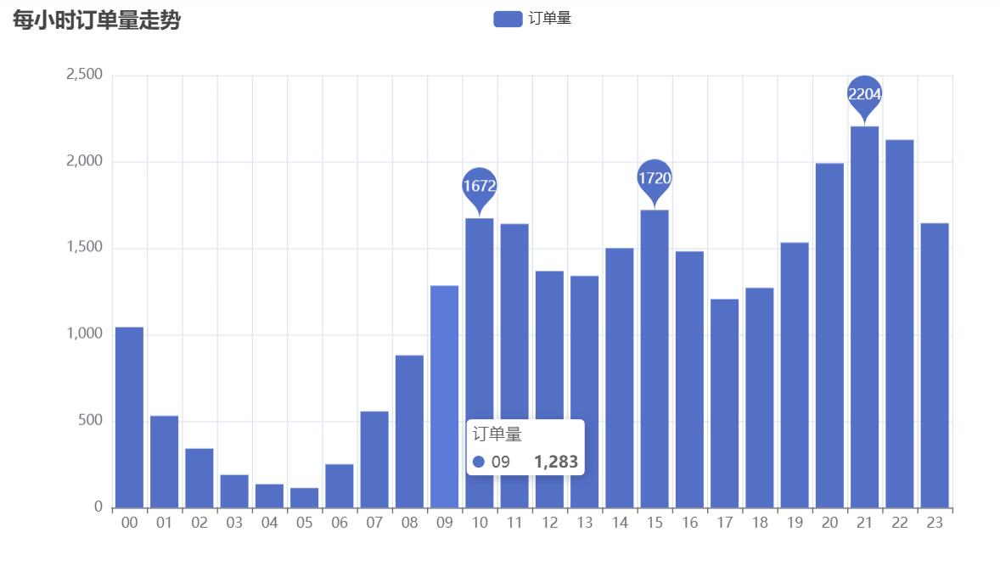

### 2.7 下单到付款平均耗时

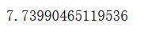

## 三、第二部分：双十一淘宝美妆数据分析（双十一淘宝美妆数据.csv）

### 3.1 读取与清洗

```python
import pandas as pd
data2 = pd.read_csv('双十一淘宝美妆数据.csv')
data2.head()
data2.info()
data2[data2.duplicated()].count() # 有86条完全重复数据
data2.drop_duplicates(inplace=True)   # 删除重复数据
data2.reset_index(drop=True, inplace=True)  # 重建索引
data2.isnull().sum()  # 查看空值 ，销售数量和评论数有空值
data2.fillna(0, inplace=True) # 空值填充0
data2['update_time'] = pd.to_datetime(data2['update_time']).apply(lambda x: x.strftime("%Y-%m-%d")) # 日期格式化
data2['sale_amount'] = data2['price'] * data2['sale_count']  # 计算销售额
```

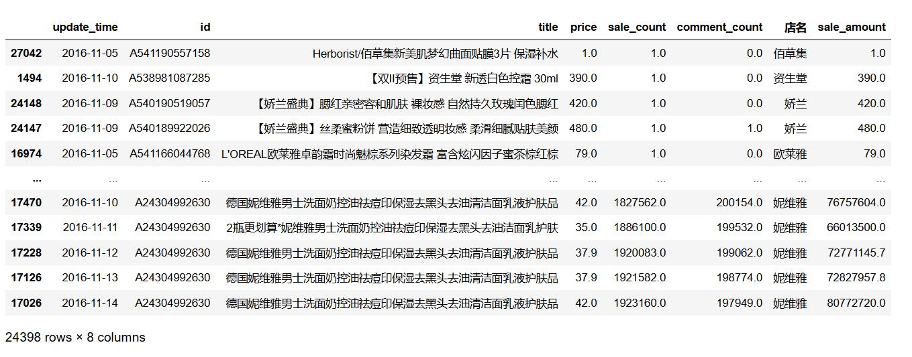

### 3.2 每日整体销售量走势（面积折线）

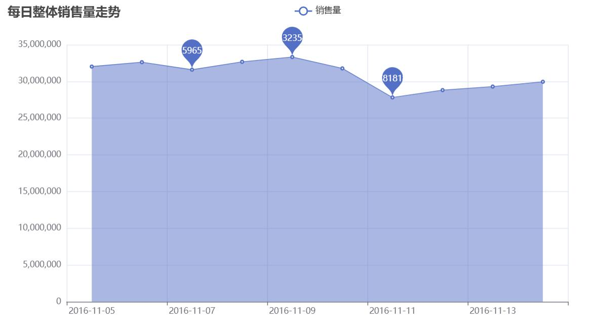

### 3.3 Timeline 时间轮播：累计销售量排行 TOP10

按时间累计，动态展示店铺销量排行变化。

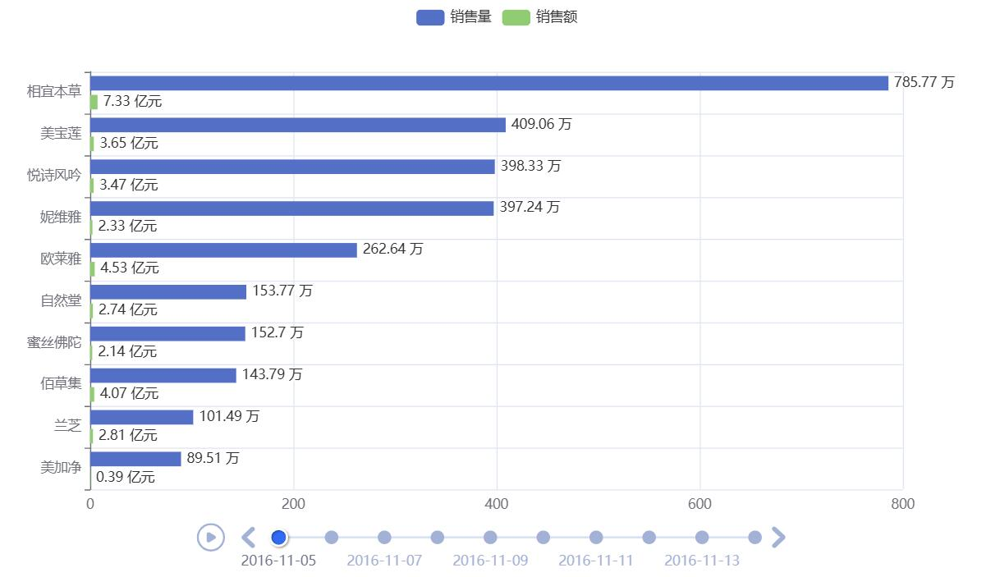

### 3.4 店铺销量占比饼图

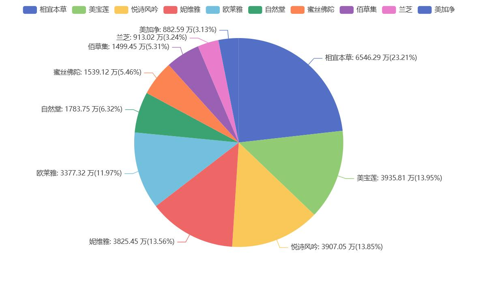

### 3.5 店铺平均价格 TOP20 横向柱状

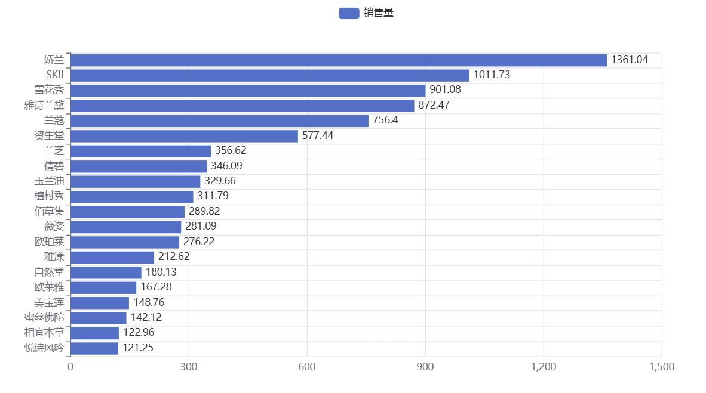

## 四、第三部分：日化销售数据分析（日化.xlsx）

### 4.1 读取两个 sheet、数据清洗

```python
import pandas as pd
fact_order = pd.read_excel('日化.xlsx', sheet_name='销售订单表')
dim_product = pd.read_excel('日化.xlsx', sheet_name='商品信息表')

# 商品信息表校验
dim_product.head()
dim_product.describe()
dim_product[dim_product.duplicated()].count()
dim_product[dim_product['商品编号'].duplicated()].count()
dim_product.isnull().sum()

# 销售订单表清洗
fact_order.head()
fact_order.info()
fact_order[fact_order.duplicated()].count()
fact_order.drop_duplicates(inplace=True)
fact_order.reset_index(drop=True, inplace=True)
fact_order.isnull().sum()
# 前后向填充空值
fact_order.fillna(method='bfill', inplace=True)
fact_order.fillna(method='ffill', inplace=True)

# 解析特殊格式日期 2019#05#06
fact_order['订单日期'] = fact_order['订单日期'].apply(lambda x: pd.to_datetime(x, format='%Y#%m#%d') if isinstance(x, str) else x)
fact_order = fact_order[fact_order['订单日期'] < '2021-01-01'] # 过滤脏数据

# 去除单位字符，转为数值
fact_order['订购数量'] = fact_order['订购数量'].apply(lambda x: x.strip('个') if isinstance(x, str) else x).astype('int')
fact_order['订购单价'] = fact_order['订购单价'].apply(lambda x: x.strip('元') if isinstance(x, str) else x).astype('float')
fact_order['金额'] = fact_order['金额'].astype('float')

# 省份文本清洗
fact_order['所在省份'] = fact_order['所在省份'].str.replace('自治区|维吾尔|回族|壮族|省|市', '')
# 客户编码清理
fact_order['客户编码'] = fact_order['客户编码'].str.replace('编号', '')
```
### 4.2 每月订购情况柱状图

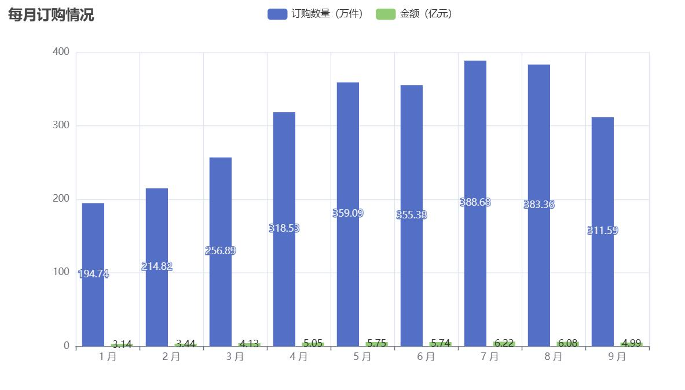

### 4.3 各地市订购数量 TOP20

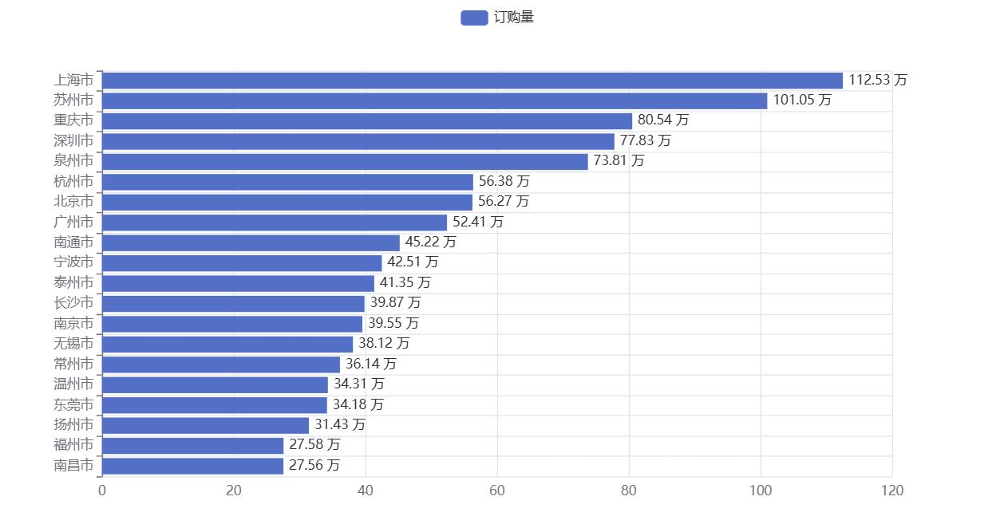

### 4.4 省份订购数量地图

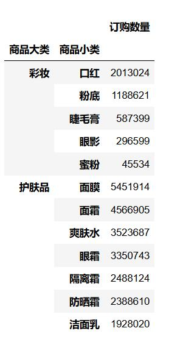

### 4.5 订单表与商品信息表关联

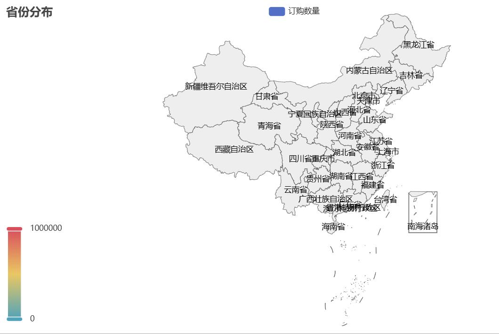

### 4.6 RFM 客户打分模型

> 
> R：最近一次购买；F：消费频率；M：消费金额；按百分比排名加权计算客户综合得分

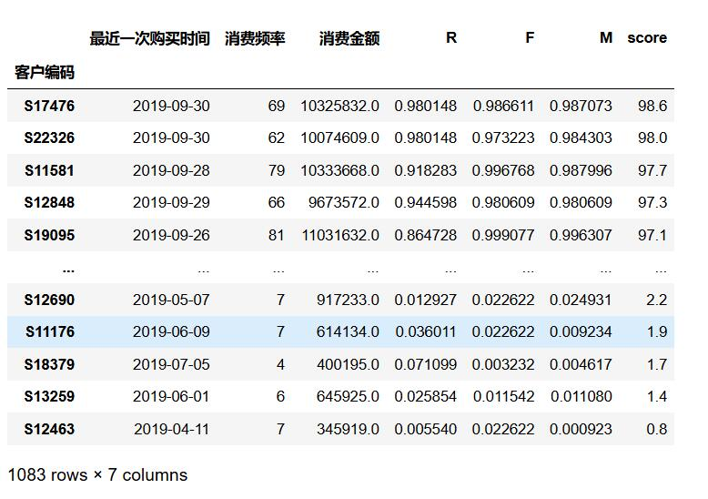

根据这个分数结果，我们可以对客户打上一些标签，比如大于 80 分的，标志为优质客户，在资源有限的情况下，可以优先服务好优质客户。